# Assignment 1

- [Assignment 1](#assignment-1)
  - [1. Practicing with Cameras](#1-practicing-with-cameras)
    - [1.1. 360-degree Renders (5 points)](#11-360-degree-renders-5-points)
    - [1.2 Re-creating the Dolly Zoom (10 points)](#12-re-creating-the-dolly-zoom-10-points)
  - [2. Practicing with Meshes](#2-practicing-with-meshes)
    - [2.1 Constructing a Tetrahedron (5 points)](#21-constructing-a-tetrahedron-5-points)
    - [2.2 Constructing a Cube (5 points)](#22-constructing-a-cube-5-points)
  - [3. Re-texturing a mesh (10 points)](#3-re-texturing-a-mesh-10-points)
  - [4. Camera Transformations (10 points)](#4-camera-transformations-10-points)
  - [5. Rendering Generic 3D Representations](#5-rendering-generic-3d-representations)
    - [5.1 Rendering Point Clouds from RGB-D Images (10 points)](#51-rendering-point-clouds-from-rgb-d-images-10-points)
    - [5.2 Parametric Functions (10 + 5 points)](#52-parametric-functions-10--5-points)
    - [5.3 Implicit Surfaces (15 + 5 points)](#53-implicit-surfaces-15--5-points)
  - [6. Do Something Fun (10 points)](#6-do-something-fun-10-points)
  - [(Extra Credit) 7. Sampling Points on Meshes (10 points)](#extra-credit-7-sampling-points-on-meshes-10-points)

## 1. Practicing with Cameras

### 1.1. 360-degree Renders (5 points)

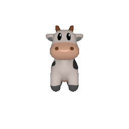

### 1.2 Re-creating the Dolly Zoom (10 points)

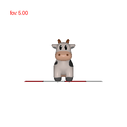

## 2. Practicing with Meshes

### 2.1 Constructing a Tetrahedron (5 points)

Vertices: 4, Faces: 4

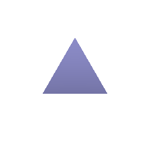

### 2.2 Constructing a Cube (5 points)

Vertices: 8, Faces: 12

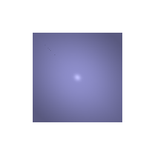

## 3. Re-texturing a mesh (10 points)

Color 1: Magenta [1.0, 0.0, 1], Color 2: Yellow [1.0, 1.0, 0.0]

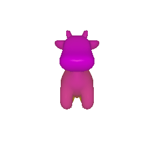

## 4. Camera Transformations (10 points)

View 1: R = [[0, 1, 0], [-1, 0, 0], [0, 0, 1]], T = [0, 0 ,0]

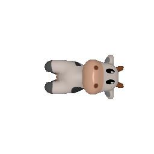

View 2: R = [[1, 0, 0], [0, 1, 0], [0, 0, 1]], T = [0, 0 ,2]

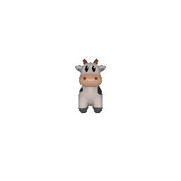

View 3: R = [[1, 0, 0], [0, 1, 0], [0, 0, 1]], T = [0.5, -0.5 , 0]

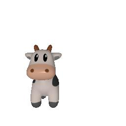

View 4: R = [[0, 0, 1], [0, 1, 0], [-1, 0, 0]], T = [-3, 0 ,3]

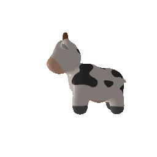

## 5. Rendering Generic 3D Representations

### 5.1 Rendering Point Clouds from RGB-D Images (10 points)

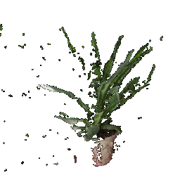
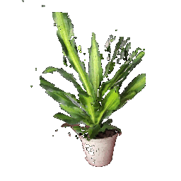
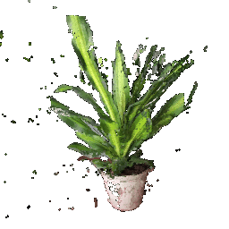

### 5.2 Parametric Functions (10 + 5 points)

Torus

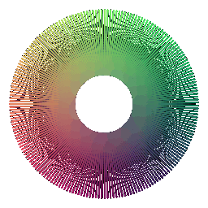

New object: Klein bottle

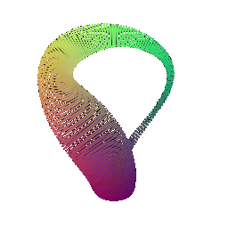

### 5.3 Implicit Surfaces (15 + 5 points)

Torus

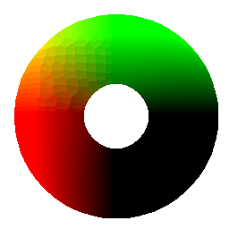

Rendering a mesh vs a point cloud:

Rendering speed: rendering a mesh is faster because mesh representation is more 
compact, especially when representing a face, where as point cloud needs dense points to represent a face.

Rendering quality: mesh representation provides better rendering quality. The suface is smoother when compared to pointcloud.

Ease of use: mesh representation requires preprocessing to construct the faces and vertices, whereas point cloud is easier to use.

Memory usage: mesh takes less memory due to structured geometry, whereas pointcloud stores individual position and feature (e.g. color) will takes up larger memory.

New object: hyperbolic paraboloid (a saddle)

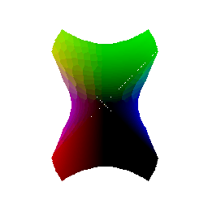

## 6. Do Something Fun (10 points)

Retexturing a RPG mesh with it's UV Map

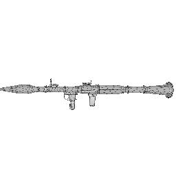

[Source](https://warmerise.com/)

## (Extra Credit) 7. Sampling Points on Meshes (10 points)

num_samples = 10

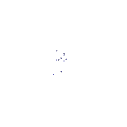

num_samples = 100

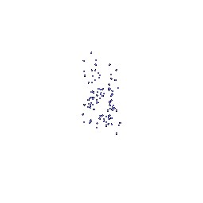

num_samples = 1000

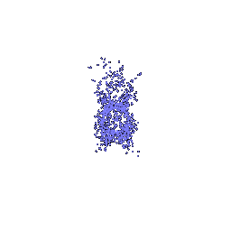

num_samples = 10000

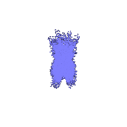

