# Assignment 2

Liwei Yang, liweiy@andrew.cmu.edu

- [Assignment 2](#assignment-2)
  - [1. Exploring loss functions](#1-exploring-loss-functions)
    - [1.1. Fitting a voxel grid (5 points)](#11-fitting-a-voxel-grid-5-points)
    - [1.2. Fitting a point cloud (5 points)](#12-fitting-a-point-cloud-5-points)
    - [1.3. Fitting a mesh (5 points)](#13-fitting-a-mesh-5-points)
  - [2. Reconstructing 3D from single view](#2-reconstructing-3d-from-single-view)
    - [2.1. Image to voxel grid (20 points)](#21-image-to-voxel-grid-20-points)
    - [2.2. Image to point cloud (20 points)](#22-image-to-point-cloud-20-points)
    - [2.3. Image to mesh (20 points)](#23-image-to-mesh-20-points)
    - [2.4. Quantitative comparisions(10 points)](#24-quantitative-comparisions10-points)
    - [2.5. Analyse effects of hyperparams variations (10 points)](#25-analyse-effects-of-hyperparams-variations-10-points)
    - [2.6. Interpret your model (15 points)](#26-interpret-your-model-15-points)
  - [3. Exploring other architectures / datasets.](#3-exploring-other-architectures--datasets)

## 1. Exploring loss functions

### 1.1. Fitting a voxel grid (5 points)

Optimized voxel grid

Ground truth voxel grid

### 1.2. Fitting a point cloud (5 points)

Optimized point cloud

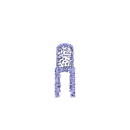

Ground truth point cloud

### 1.3. Fitting a mesh (5 points)

Optimized mesh

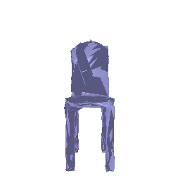

Ground truth mesh

## 2. Reconstructing 3D from single view

### 2.1. Image to voxel grid (20 points)

Sample \# 0

Ground truth mesh

Predicted vox

Sample \# 100

Ground truth mesh

Predicted vox

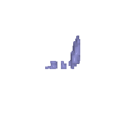

Sample \# 400

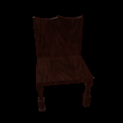

Ground truth mesh

Predicted vox

### 2.2. Image to point cloud (20 points)

Sample \# 0

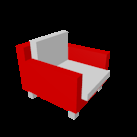

Ground truth mesh

Predicted point cloud

Sample \# 100

Ground truth mesh

Predicted point cloud

Sample \# 400

Ground truth mesh

Predicted point cloud

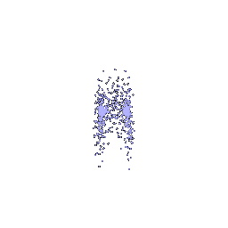

### 2.3. Image to mesh (20 points)

Sample \# 0

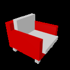

Ground truth mesh

Predicted mesh

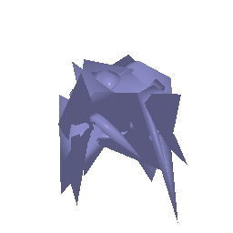

Sample \# 100

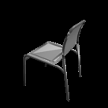

Ground truth mesh

Predicted mesh

Sample \# 400

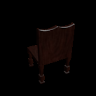

Ground truth mesh

Predicted mesh

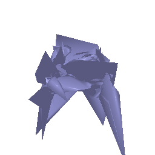

### 2.4. Quantitative comparisions(10 points)

Voxel evaluation

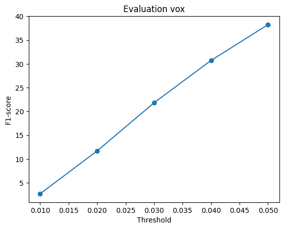

Point cloud evaluation

Mesh evaluation

From the result, we can see point cloud model achieve the best F1 score, and voxel model has the worst performance.

One reasone behind this might be some of the chair legs, or other thin features are too small to occupy one voxel. thus from sample \#400 we can see the chair is missing the legs. For mesh model, the data structure is in natrual more complex than point cloud, thus the thin legs are also often only represented by a thin face. Point cloud model benefits from the simple data structure and thus has the best performace in terms of F1 score. 

### 2.5. Analyse effects of hyperparams variations (10 points)

I change the n_points of point cloud model to 1500 points. The evaluation result is as below:

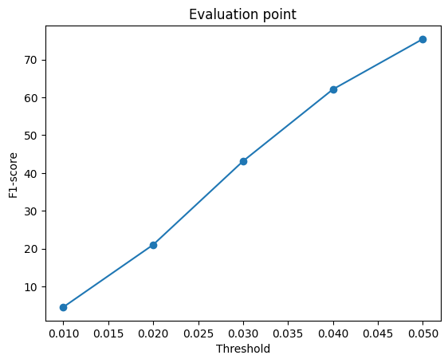

Sample \# 400

Ground truth mesh

1000 points

1500 points

We can see the back panel becomes denser and represent the mesh ground truth better. The F1 score is also generally higher when compare to the same threshold of 1000 points. Adding more points should amplify this difference more.

### 2.6. Interpret your model (15 points)

I visulize the training process of mesh model

iter 0

iter 50

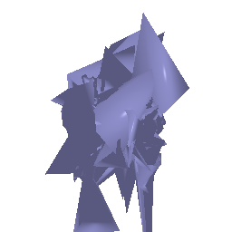

iter 150

iter 250

From iter 0, we can see the isosphere is still big and the cameras are within the isosphere. As we train more iters, the mesh gradually forms a general chair sturcture.

## 3. Exploring other architectures / datasets.

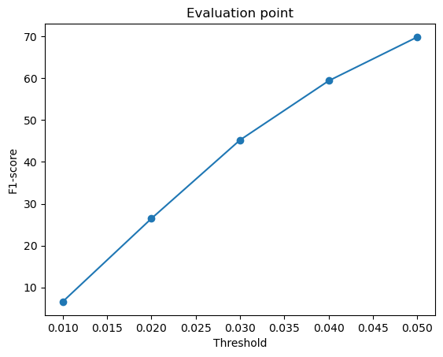

Sample \#40

Model prediction

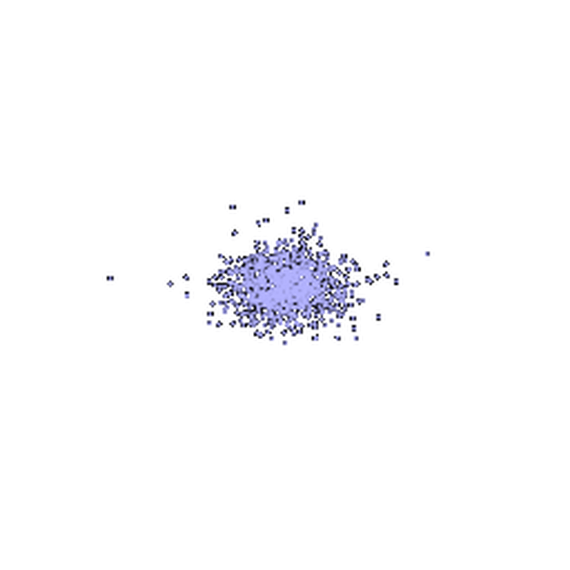

Ground truth mesh

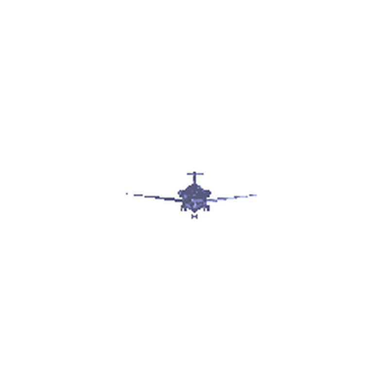

Sample \#460

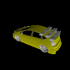

Model prediction

Ground truth mesh

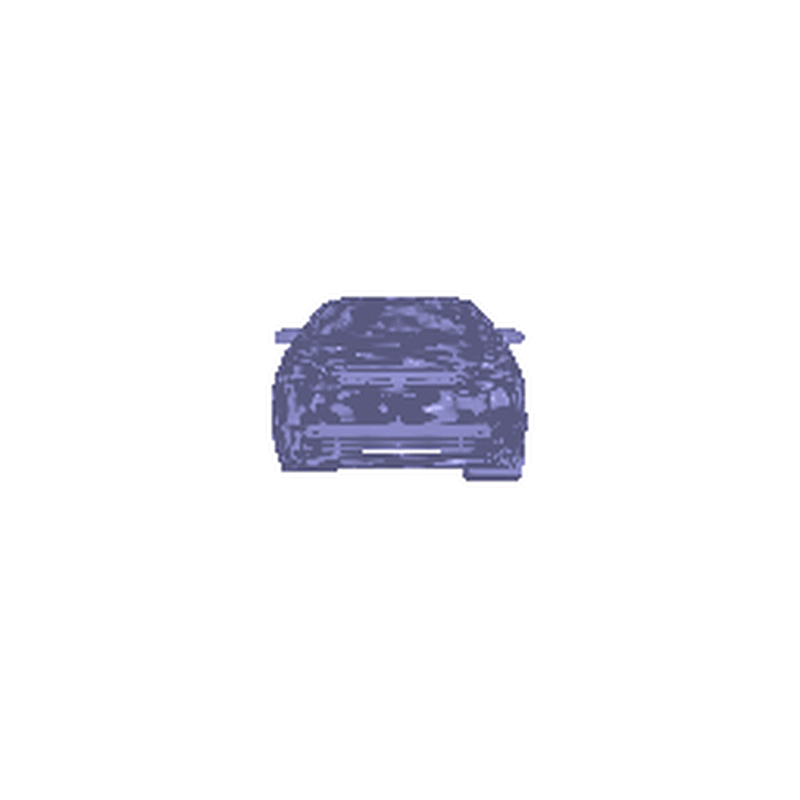

Sample \#1450

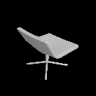

Model prediction

Training on one class provides more steady result. The reason might be Training on three classes cause confusion to the model. The chair prediction gets worse. The F1 score across 3 dataset is roughly the same as the F1 socre on chair dataset.

