# Assignment 3

Liwei Yang, liweiy@andrew.cmu.edu

Collaborators: fuchengp, jiamuz, jinkaiq

- [Assignment 3](#assignment-3)
- [A. Neural Volume Rendering (80 points)](#a-neural-volume-rendering-80-points)
  - [0. Transmittance Calculation (10 points)](#0-transmittance-calculation-10-points)
  - [1. Differentiable Volume Rendering](#1-differentiable-volume-rendering)
    - [1.1. Familiarize yourself with the code structure](#11-familiarize-yourself-with-the-code-structure)
    - [1.2. Outline of tasks](#12-outline-of-tasks)
    - [1.3. Ray sampling (5 points)](#13-ray-sampling-5-points)
    - [1.4. Point sampling (5 points)](#14-point-sampling-5-points)
    - [1.5. Volume rendering (20 points)](#15-volume-rendering-20-points)
  - [2. Optimizing a basic implicit volume](#2-optimizing-a-basic-implicit-volume)
    - [2.1. Random ray sampling (5 points)](#21-random-ray-sampling-5-points)
    - [2.2. Loss and training (5 points)](#22-loss-and-training-5-points)
    - [2.3. Visualization](#23-visualization)
  - [3. Optimizing a Neural Radiance Field (NeRF) (20 points)](#3-optimizing-a-neural-radiance-field-nerf-20-points)
  - [4. NeRF Extras (CHOOSE ONE! More than one is extra credit)](#4-nerf-extras-choose-one-more-than-one-is-extra-credit)
    - [4.1 View Dependence (10 points)](#41-view-dependence-10-points)
    - [4.2 Coarse/Fine Sampling (10 points)](#42-coarsefine-sampling-10-points)
- [B. Neural Surface Rendering (50 points)](#b-neural-surface-rendering-50-points)
  - [5. Sphere Tracing (10 points)](#5-sphere-tracing-10-points)
  - [6. Optimizing a Neural SDF (15 points)](#6-optimizing-a-neural-sdf-15-points)
  - [7. VolSDF (15 points)](#7-volsdf-15-points)
  - [8. Neural Surface Extras (CHOOSE ONE! More than one is extra credit)](#8-neural-surface-extras-choose-one-more-than-one-is-extra-credit)
    - [8.1. Render a Large Scene with Sphere Tracing (10 points)](#81-render-a-large-scene-with-sphere-tracing-10-points)
    - [8.2 Fewer Training Views (10 points)](#82-fewer-training-views-10-points)
    - [8.3 Alternate SDF to Density Conversions (10 points)](#83-alternate-sdf-to-density-conversions-10-points)

# A. Neural Volume Rendering (80 points)

## 0. Transmittance Calculation (10 points)

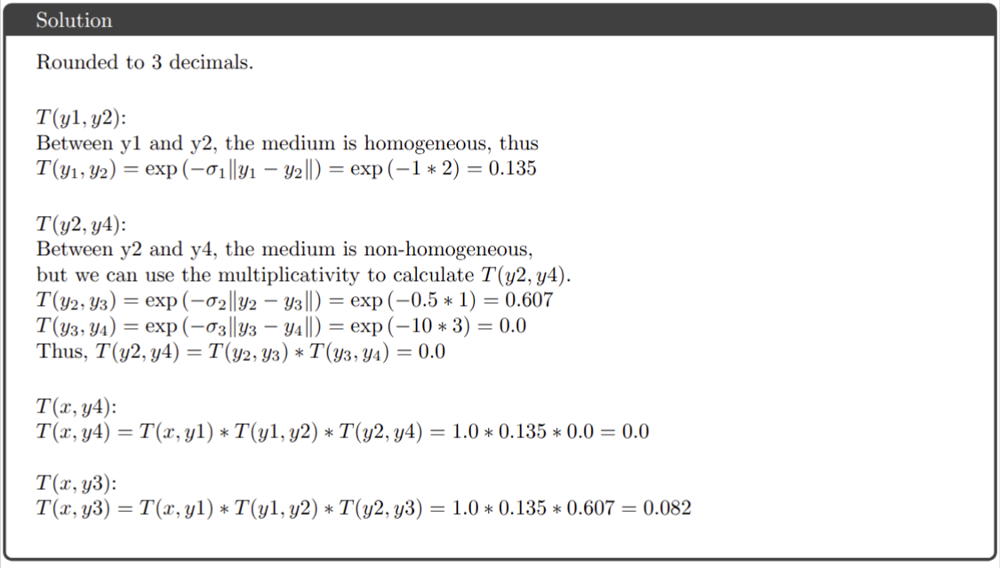

##  1. Differentiable Volume Rendering

###  1.1. Familiarize yourself with the code structure

###  1.2. Outline of tasks

###  1.3. Ray sampling (5 points)

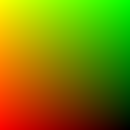 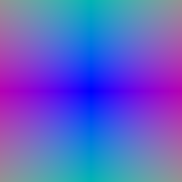

###  1.4. Point sampling (5 points)

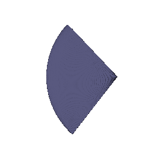

###  1.5. Volume rendering (20 points)

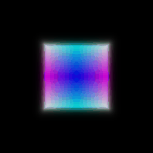 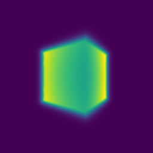

##  2. Optimizing a basic implicit volume

###  2.1. Random ray sampling (5 points)

###  2.2. Loss and training (5 points)

rounded to 2 deciamls

center of the box after training:(0.25, 0.25, 0.00)

side lengths of the box after training: (2.01, 1.50, 1.50)

###  2.3. Visualization
|Trained|TA|
|:--:|:--:|
|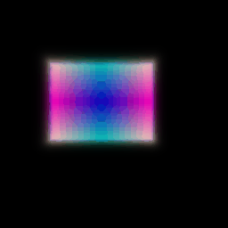||

##  3. Optimizing a Neural Radiance Field (NeRF) (20 points)

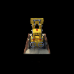

##  4. NeRF Extras (CHOOSE ONE! More than one is extra credit)

###  4.1 View Dependence (10 points)

|Data|Not View Dependent|View Dependent|
|:--:|:--:|:--:|
|Lego|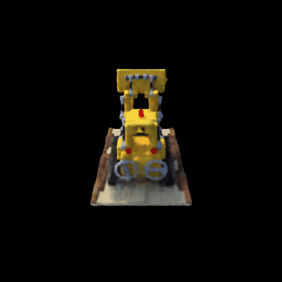|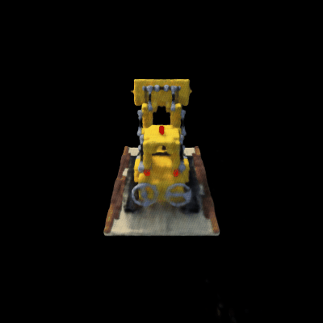|
|Mateirals|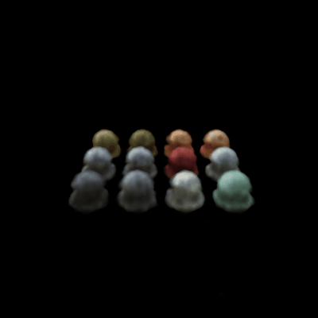|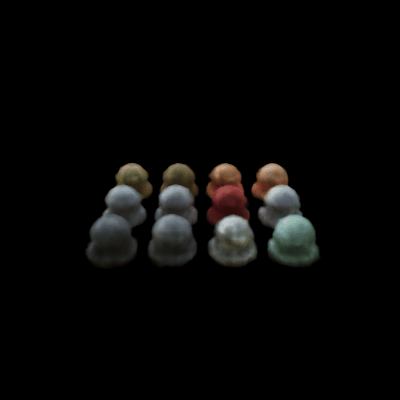|

As we can see from the two high resolution dataset, with view dependet, the side view of lego feels more realistic and contrast. From materials dataset, we can see the refelction feels more metallic and realistic.

One thing to note down is that adding view dependet makes the model more complex and harder to train. Also may lead to potential overfit on some of the directions.

###  4.2 Coarse/Fine Sampling (10 points)

# B. Neural Surface Rendering (50 points)

##  5. Sphere Tracing (10 points)

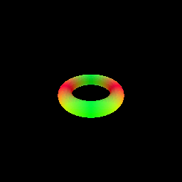

The algorithm starts initilizing points at camera origins, iteratively we march the points with signed distance along the ray. If a point hit the surface, we stop operating the point. We run the algorithm until all points hit the surface or max_iter reached. To prevent we left off some points, we still include points that are within the max range but not on the surface.

##  6. Optimizing a Neural SDF (15 points)

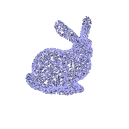 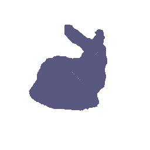

My MLP has four chunks, the first chunk embed the points with harmonic embedding, after that a common MLP network has structure MLPWithInputSkips takes in the embedding, and send it to a distance network has structure MLPWithInputSkips, and another color network has 3 linear layers.

Eikonol loss takes in the neural network's gradient, calculates its norm and make it close to 1 as possible. This helps the neural network to generates smoother surface. Taking the mean helps the loss to be not too big, ensure smooth training also.

##  7. VolSDF (15 points)

From [VolSDF](https://arxiv.org/abs/2106.12052) paper, we have two formulas:

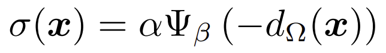

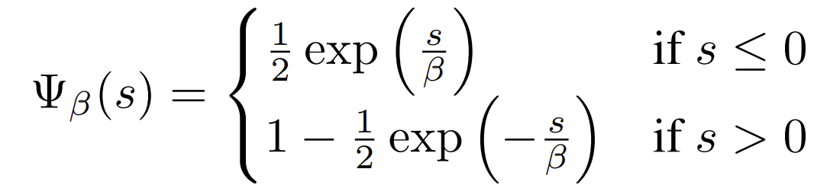

where sigma is the density, alpha and beta are the tuned parameters and omega is the signed distance function. Ψ_β is the Cumulative Distribution Function (CDF) of
the Laplace distribution with zero mean and β scale. Large beta would bias the surface to have smoother transition, and low beta would encourage sharper representation. With large beta the SDF will be easier to train because it has a more stable gradient. If I were to learn an accurate surface, I would choose low beta so I can catch more high frequency features.

The below is the result with default beta (0.05)

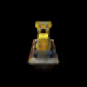  

The below is the result with 10 times beta (0.5)

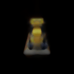 

Changed hyperparameters: n_harmonic_functions_xyz: 6 -> 4, n_layers_distance: 6 -> 2

Less layers helped us to train faster, I should not lower n_harmonic_functions_xyz, this reduced the details. With larger n_harmonic_functions_xyz I should be able to produce better results.

## 8. Neural Surface Extras (CHOOSE ONE! More than one is extra credit)

### 8.1. Render a Large Scene with Sphere Tracing (10 points)

### 8.2 Fewer Training Views (10 points)

| Settings       | NeRF                        | VolSDF                     | VolSDF Geometry             |
|---------------|----------------------------|----------------------------|----------------------------|
| Full dataset  |  |  |  |
| 1/10 dataset  | 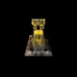 | 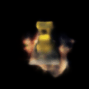 | 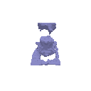 |

As we can see, with fewer trainging views, both methonds degrades. From the red lights on top of the bulldozer and the details in the back of the bulldozer, we can tell that NeRF degrades more significantly. However, NeRF still captures more detail than VolSDF.

### 8.3 Alternate SDF to Density Conversions (10 points)
