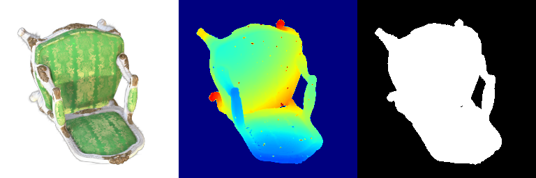
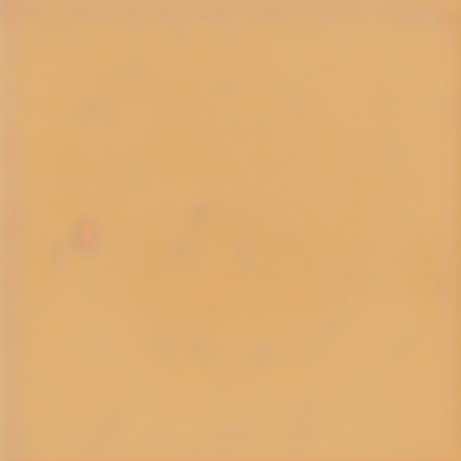
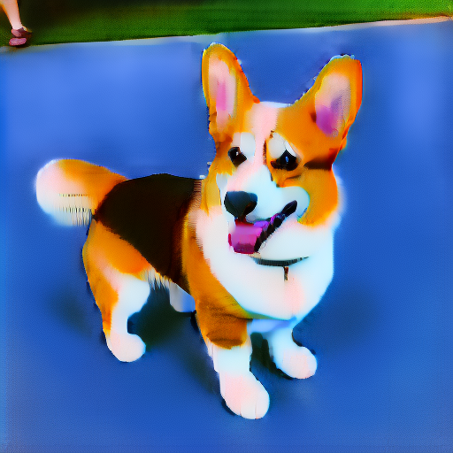

# Assignment 4

Liwei Yang, liweiy@andrew.cmu.edu

Collaborators: fuchengp, jiamuz, jinkaiq

- [Assignment 4](#assignment-4)
- [0. Environment Setup](#0-environment-setup)
- [1. 3D Gaussian Splatting](#1-3d-gaussian-splatting)
  - [1.1 3D Gaussian Rasterization (35 points)](#11-3d-gaussian-rasterization-35-points)
    - [1.1.1 Project 3D Gaussians to Obtain 2D Gaussians](#111-project-3d-gaussians-to-obtain-2d-gaussians)
    - [1.1.3 Filter and Sort Gaussians](#113-filter-and-sort-gaussians)
    - [1.1.4 Compute Alphas and Transmittance](#114-compute-alphas-and-transmittance)
    - [1.1.5 Perform Splatting](#115-perform-splatting)
  - [1.2 Training 3D Gaussian Representations (15 points)](#12-training-3d-gaussian-representations-15-points)
    - [1.2.1 Setting Up Parameters and Optimizer](#121-setting-up-parameters-and-optimizer)
    - [1.2.2 Perform Forward Pass and Compute Loss](#122-perform-forward-pass-and-compute-loss)
  - [1.3 Extensions **(Choose at least one! More than one is extra credit)**](#13-extensions-choose-at-least-one-more-than-one-is-extra-credit)
    - [1.3.1 Rendering Using Spherical Harmonics (10 Points)](#131-rendering-using-spherical-harmonics-10-points)
    - [1.3.2 Training On a Harder Scene (10 Points)](#132-training-on-a-harder-scene-10-points)
- [2. Diffusion-guided Optimization](#2-diffusion-guided-optimization)
  - [2.1 SDS Loss + Image Optimization (20 points)](#21-sds-loss--image-optimization-20-points)
  - [2.2 Texture Map Optimization for Mesh (15 points)](#22-texture-map-optimization-for-mesh-15-points)
  - [2.3 NeRF Optimization (15 points)](#23-nerf-optimization-15-points)
  - [2.4 Extensions (Choose at least one! More than one is extra credit)](#24-extensions-choose-at-least-one-more-than-one-is-extra-credit)
    - [2.4.1 View-dependent text embedding (10 points)](#241-view-dependent-text-embedding-10-points)
    - [2.4.2 Other 3D representation (10 points)](#242-other-3d-representation-10-points)
    - [2.4.3 Variation of implementation of SDS loss (10 points)](#243-variation-of-implementation-of-sds-loss-10-points)

# 0. Environment Setup

# 1. 3D Gaussian Splatting

## 1.1 3D Gaussian Rasterization (35 points)

### 1.1.1 Project 3D Gaussians to Obtain 2D Gaussians

### 1.1.3 Filter and Sort Gaussians

### 1.1.4 Compute Alphas and Transmittance

### 1.1.5 Perform Splatting

## 1.2 Training 3D Gaussian Representations (15 points)

### 1.2.1 Setting Up Parameters and Optimizer

### 1.2.2 Perform Forward Pass and Compute Loss

**Training progress**

**Final rendered views**

- Opacities learning rate: 0.05
- Scales learning rate: 0.005
- Colours learning rate: 0.02
- Means learning rate: 0.0005
- Number of iterations: 500
- Mean PSNR: 28.614
- Mean SSIM: 0.931

## 1.3 Extensions **(Choose at least one! More than one is extra credit)**

### 1.3.1 Rendering Using Spherical Harmonics (10 Points)

**Result**

|# of View|Without Spherical Harmonics|With Spherical Harmonics|
|:--:|:--:|:--:|
|View 000|||
|View 002|||

For View 000, we can see the shading with spherical harmonics is more natrural. We can tell by the cusion and the chair handles.

For View 002, we can see the shading on the cusion and the chair-back is more realistic with spherical harmonics.

### 1.3.2 Training On a Harder Scene (10 Points)

# 2. Diffusion-guided Optimization

## 2.1 SDS Loss + Image Optimization (20 points)

**Prompt:** a hamburger
|Without Guidance (1000 iterations)|With Guidance (1000 iterations)|
|:--:|:--:|
|||

**Prompt:** a standing corgi dog
|Without Guidance (1000 iterations)|With Guidance (1000 iterations)|
|:--:|:--:|
|||

**Prompt:** an unicorn
|Without Guidance (200 iterations)|With Guidance (2000 iterations)|
|:--:|:--:|
|||

**Prompt:** a place in my dream
|Without Guidance (800 iterations)|With Guidance (800 iterations)|
|:--:|:--:|
|||

## 2.2 Texture Map Optimization for Mesh (15 points)

**Prompt:** a zebra
|Initial Mesh|Final Mesh|
|:--:|:--:|
|||

**Prompt:** a leopard
|Initial Mesh|Final Mesh|
|:--:|:--:|
|||

## 2.3 NeRF Optimization (15 points)

- lambda_entropy: 0.001
- lambda_orient: 0.01
- latent_iter_ratio: 0.2

**Prompt:** a standing corgi dog
|RGB|Depth|
|:--:|:--:|
|||

**Prompt:** an unicorn
|RGB|Depth|
|:--:|:--:|
|||

**Prompt:** a rose
|RGB|Depth|
|:--:|:--:|
|||

## 2.4 Extensions (Choose at least one! More than one is extra credit)

### 2.4.1 View-dependent text embedding (10 points)
- lambda_entropy: 0.0005
- lambda_orient: 0.0005
- latent_iter_ratio: 0.01

**Prompt:** a standing corgi dog
|RGB|Depth|
|:--:|:--:|
|||

**Prompt:** an unicorn
|RGB|Depth|
|:--:|:--:|
|||

With view depedency, the multi-ears of corgi dog is resolved, and the number of legs of the unicorn is also correct. 

### 2.4.2 Other 3D representation (10 points)

### 2.4.3 Variation of implementation of SDS loss (10 points)
