# Assignment 5

Liwei Yang, liweiy@andrew.cmu.edu

Collaborators: fuchengp, jiamuz, jinkaiq

- [Assignment 5](#assignment-5)
  - [Q1. Classification Model (40 points)](#q1-classification-model-40-points)
    - [Successful predictions](#successful-predictions)
    - [Wrong predictions](#wrong-predictions)
  - [Q2. Segmentation Model (40 points)](#q2-segmentation-model-40-points)
    - [Good predictions](#good-predictions)
    - [Bad predictions](#bad-predictions)
  - [Q3. Robustness Analysis (20 points)](#q3-robustness-analysis-20-points)
    - [Classification Model](#classification-model)
      - [Rotation](#rotation)
        - [Successful predictions](#successful-predictions-1)
        - [Wrong predictions](#wrong-predictions-1)
      - [Fewer points](#fewer-points)
        - [Successful predictions](#successful-predictions-2)
        - [Wrong predictions](#wrong-predictions-2)
    - [Segmentation Model](#segmentation-model)
      - [Rotation](#rotation-1)
        - [Good predictions](#good-predictions-1)
        - [Bad predictions](#bad-predictions-1)
      - [Fewer points](#fewer-points-1)
        - [Good predictions](#good-predictions-2)
        - [Bad predictions](#bad-predictions-2)
  - [Q4. Bonus Question - Locality (20 points)](#q4-bonus-question---locality-20-points)

## Q1. Classification Model (40 points)

I trained the model for 120 epochs. The test accuracy is 97.7%.

### Successful predictions
|Sample|Sample 1|Sample 2|Sample 3|
|:--:|:--:|:--:|:--:|
|Label|Class 0 (Chair)|Class 1 (Vase)|Class 2 (Lamp)|
|Point Cloud|||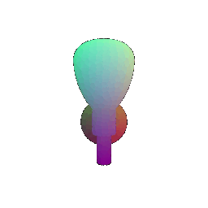|

### Wrong predictions
|Sample|Sample 1|Sample 2|
|:--:|:--:|:--:|
|Gt Label|Class 0 (Chair)|Class 1 (Vase)|
|Pred Label|Class 2 (Lamp)|Class 2 (Lamp)|
|Point Cloud||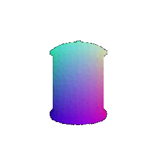|

The model predicts correctly for most of the time. Yet, for some ambiguous shapes, the model cannot predict well. For example, in the wrong predictions, sample 1 predicts a lamp on a folded chair, and for sample 2, the model predicts a rounded vase as the lamp.

## Q2. Segmentation Model (40 points) 

I trained the model for 40 epochs. The test accuracy is 89.5%.

### Good predictions
|Sample|Sample 1|Sample 2|Sample 3|
|:--:|:--:|:--:|:--:|
|Prediction|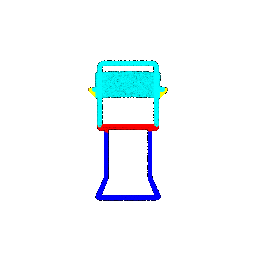|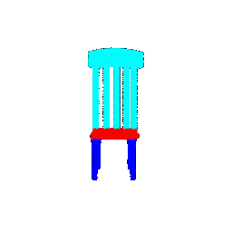|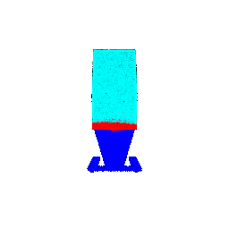|
|Ground Truth|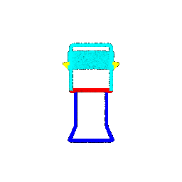|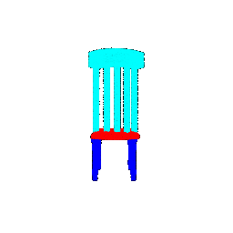|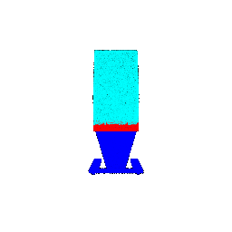|
|Accuracy|98.5%|96.6%|97.7%|

### Bad predictions
|Sample|Sample 1|Sample 2|
|:--:|:--:|:--:|
|Prediction|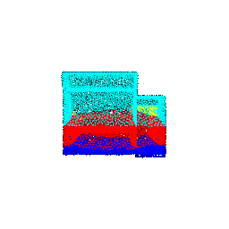|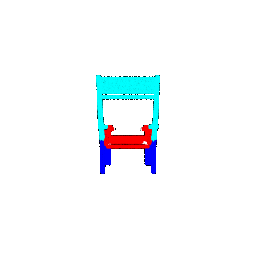|
|Ground Truth|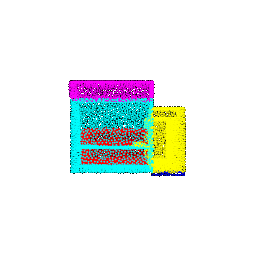|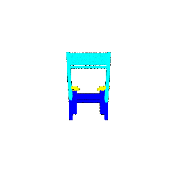|
|Accuracy|38.2%|40.4%|

The model predicts regular chairs well. Yet, when the chair has some special features, for example, sample 1 only has one armrest and sample 2 has elongated armrests, the predictions start to degrade.

## Q3. Robustness Analysis (20 points) 

### Classification Model

#### Rotation
I applied 30 degrees rotation to the z-axis.

test accuracy: 82.6%

##### Successful predictions
|Sample|Sample 1|Sample 2|Sample 3|
|:--:|:--:|:--:|:--:|
|Label|Class 0 (Chair)|Class 1 (Vase)|Class 2 (Lamp)|
|Point Cloud||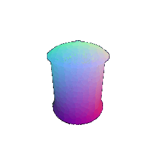|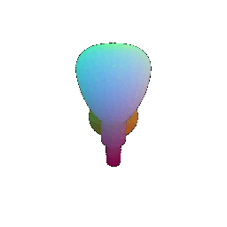|

##### Wrong predictions
|Sample|Sample 1|Sample 2|
|:--:|:--:|:--:|
|Gt Label|Class 0 (Chair)|Class 0 (Chair)|
|Pred Label|Class 2 (Lamp)|Class 2 (Lamp)|
|Point Cloud|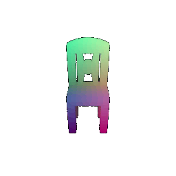|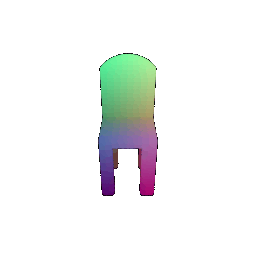|

#### Fewer points

2000 points

test accuracy: 0.9758656873032528

##### Successful predictions
|Sample|Sample 1|Sample 2|Sample 3|
|:--:|:--:|:--:|:--:|
|Label|Class 0 (Chair)|Class 1 (Vase)|Class 2 (Lamp)|
|Point Cloud||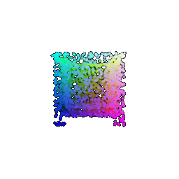|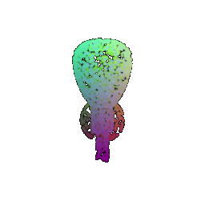|

##### Wrong predictions
|Sample|Sample 1|Sample 2|
|:--:|:--:|:--:|
|Gt Label|Class 0 (Chair)|Class 1 (Vase)|
|Pred Label|Class 2 (Lamp)|Class 2 (Lamp)|
|Point Cloud||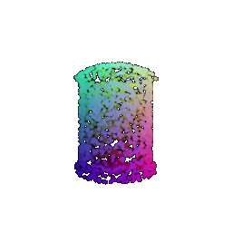|

The rotation degrades the model's performance more. I think that because fewer sample points still maintain the general shapes, the performance does not degrade that much. However, for rotation, the tilted chairback might be falsely interpreted as the neck of the lamp. Thus, the model falsely predicts that two chairs to be lamps.

### Segmentation Model

#### Rotation

I applied 30 degrees rotation to the z-axis.

test accuracy: 75.8%

##### Good predictions
|Sample|Sample 1|Sample 2|Sample 3|
|:--:|:--:|:--:|:--:|
|Prediction|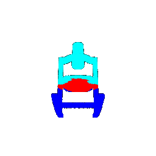|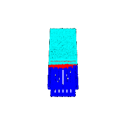|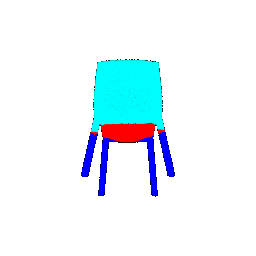|
|Ground Truth|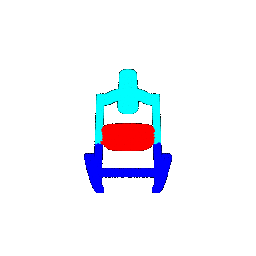|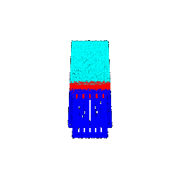|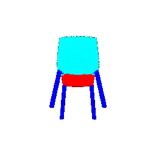|
|Accuracy|90.7%|90.8%|92.0%|

##### Bad predictions
|Sample|Sample 1|Sample 2|
|:--:|:--:|:--:|
|Prediction||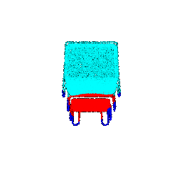|
|Ground Truth|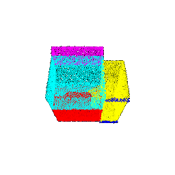|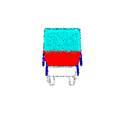|
|Accuracy|42.0%|29.3%|

#### Fewer points

2000 points

test accuracy: 0.8959611021069692

##### Good predictions
|Sample|Sample 1|Sample 2|Sample 3|
|:--:|:--:|:--:|:--:|
|Prediction|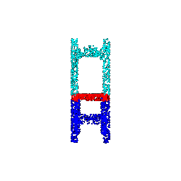|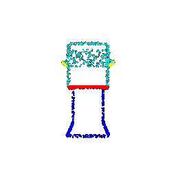||
|Ground Truth|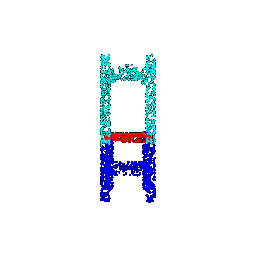|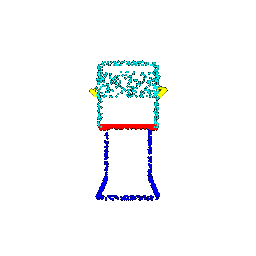|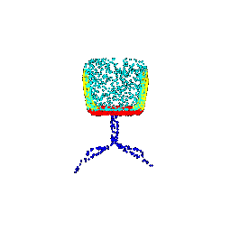|
|Accuracy|95.1%|98.8%|90.5%|

##### Bad predictions
|Sample|Sample 1|Sample 2|
|:--:|:--:|:--:|
|Prediction|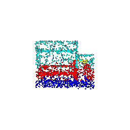|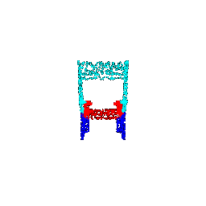|
|Ground Truth|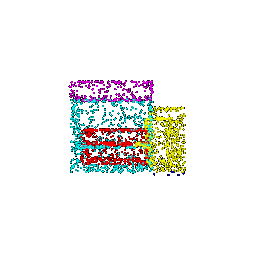|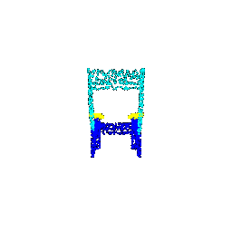|
|Accuracy|36.0%|40.2%|

Similar to the classification case, the performance degrades more when we rotate the objects. For rotation, the entire footrest is falsely predicted as the seat, and the original seat is falsely predicted as the chairback. This might come from the seat being oriented more vertically, and thus, the model falsely predicts it as the chairback. 

## Q4. Bonus Question - Locality (20 points)